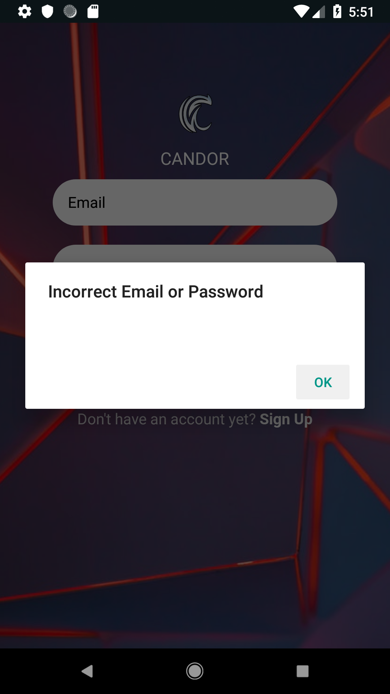
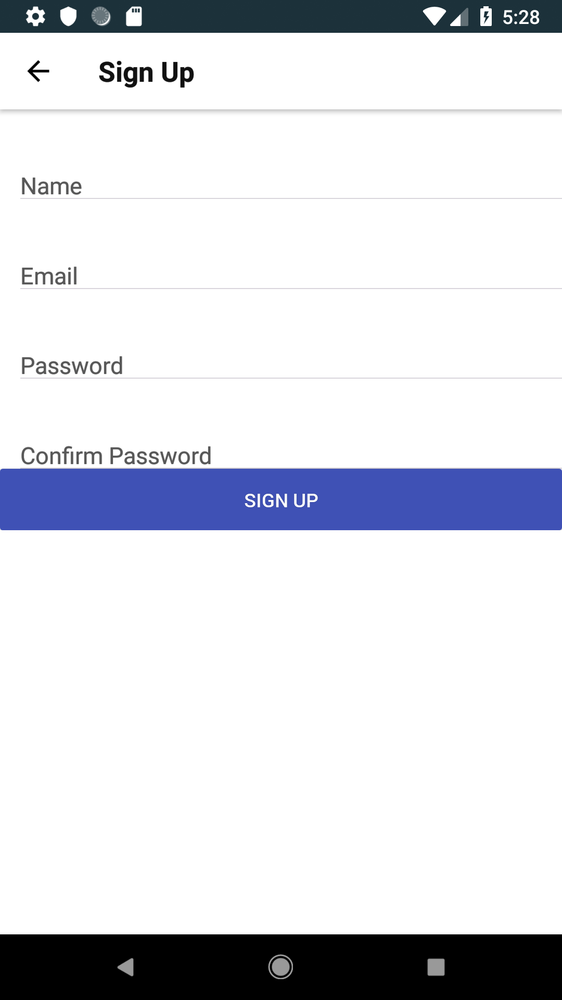
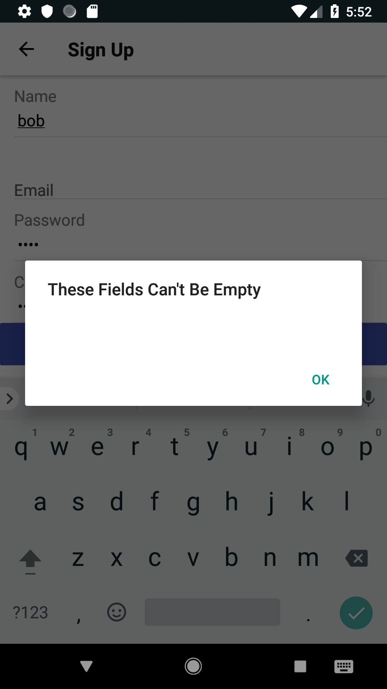
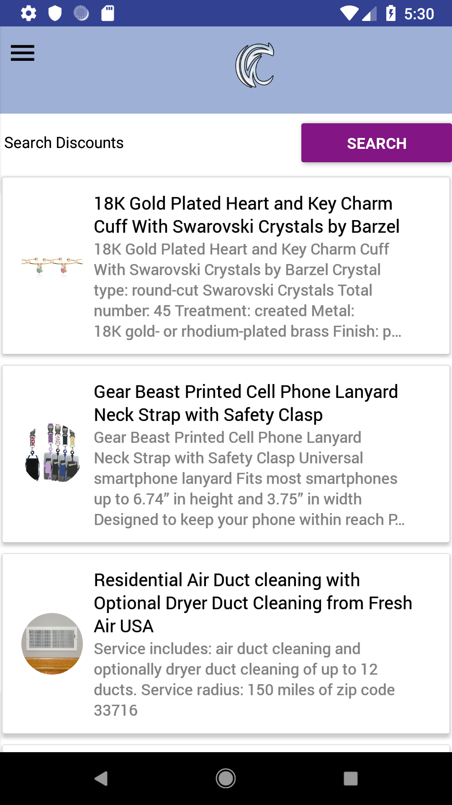
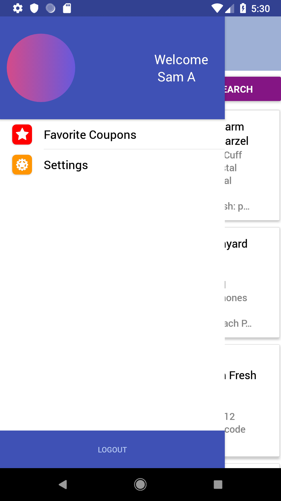
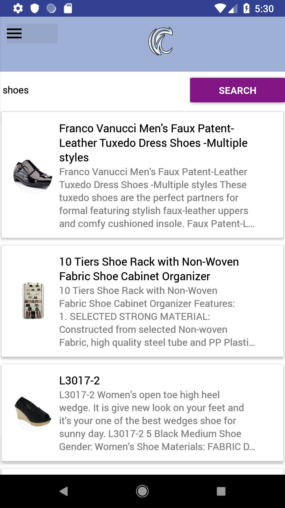
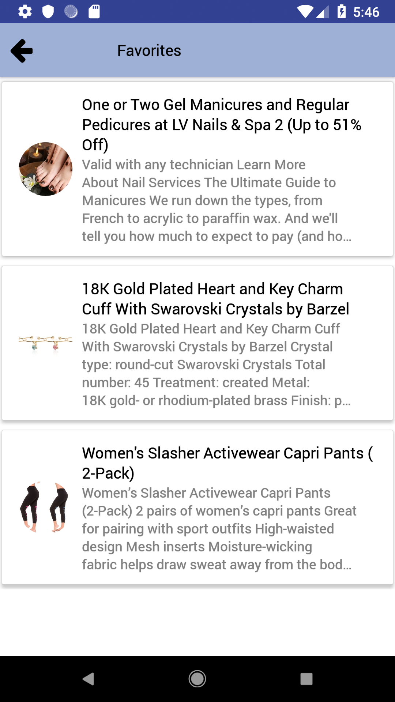
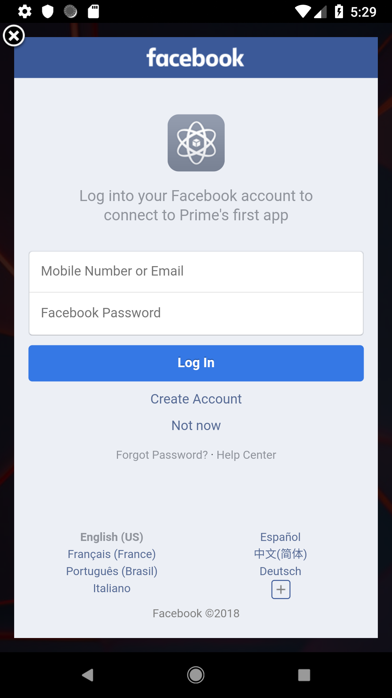

<h1 align="center">
  <br>
  
  <br>
CANDOR  
<br>
</h1>

<h4 align="center">A Native Mobile App that lets you search for discounts and deals available from the Discount API. </h4>

<p align="center">
  <a href="#key-features">Key Features</a> •
  <a href="#how-to-use">How To Use</a> •
  <a href="#about-this-app">About This App</a> •
  <a href="#images">Images</a> •
</p>

## Key Features

- Login
  - Users can create an account using the sign up form or using their facebook accounts.
  - This app uses industry standard JWT token authentication or Facebook Authentication to keep accounts secure.
- Discounts

  - Upon signing in, Candor will load a page full of discounts that are available at the moment.
  - Users can search for items/services and the app will search the api for relevant search results.
  - Users can also search discounts by location.
  - You can click on a discount which will transition the user to its view page that contains more detail on the discount.
  - On each view page, there is a order now button that will link the user to the specific coupon online when pressed.

- Favorites
  - Users can favorite discounts, which will be saved in a Postgres database, managed by a Ruby On Rails back end.
  -

## How To Use

To clone and run this application, you'll need [Git](https://git-scm.com)
and an emulator environment set-up.

```bash
# Clone these repositories
$ git clone https://github.com/samashtar/Candor


$ git clone https://github.com/samashtar/Candorbackend
#now cd into the back end
$ cd Candorbackend

# bundle install
$ bundle install

#create the db, migrate, seed and run rails server, in that order
$ rails db:create
$ rails db:migrate
$ rails db:seed
$ rails s

#now cd into the front end
$ cd Candor

#install dependences
$ npm i && yarn

# with your emulator online, start the app
$ react-native run-android
```

## About This App

- Secure Postgres Database
- JWT Token Authentication
- Facebook Authentication
- React Navigation Navigators
- React-Native Framework
- Native-Base styling (Manually Edited)
- Jest Tests
- Developed with an Android Studio Emulator
- Discount API
- Rails API for users and discounts
- Full CRUD functionality and follows REST conventions

## Images

<h3 align="center">
Login   <br>
  
  <br>
<br>
</h3>
<h3 align="center">

<h3 align="center">
Login Fail  <br>
  
  <br>
<br>
</h3>

<h3 align="center">
Sign Up  <br>
  
  <br>
<br>
</h3>
<h3 align="center">

<h3 align="center">
Sign Up Fail  <br>
  
  <br>
<br>
</h3>

<h3 align="center">
Main Page After Login <br>
  
  <br>
<br>
</h3>
<h3 align="center">

<h3 align="center">
Drawer <br>
  
  <br>
<br>
</h3>
<h3 align="center">

<h3 align="center">
Search For A Discount <br>
  
  <br>
<br>
</h3>
<h3 align="center">

<h3 align="center">
View Page For Discount <br>
  
  <br>
<br>
</h3>
<h3 align="center">

<h3 align="center">
Favorite The Discount <br>
  
  <br>
<br>
</h3>
<h3 align="center">

<h3 align="center">
Favorites Saved in Your Favorites Tab <br>
  
  <br>
<br>
</h3>
<h3 align="center">

<h3 align="center">
Facebook Sign In <br>
  
  <br>
<br>
</h3>
<h3 align="center">

---

> GitHub [@samashtar](https://github.com/samashtar/) &nbsp;&middot;&nbsp;

---
